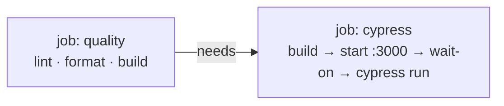

<!-- Created: 2026-06-04 02:34:28 -->
<!-- Completed: 2026-06-06 ✅ -->

# 🎯 Task: Install Cypress + Wire into CI

---

## 🧠 Rationale

Phase 1 had one trivial journey (log in), so manual checks sufficed. The desktop is the project's
first **multi-step interactive surface** — drag an icon, open a window, move it, minimize, restore
from the taskbar, close — and that is exactly the shape of test where end-to-end gives real value
over unit/RTL. `CLAUDE.md` mandates Cypress in CI; this task lights that gate up. **You write no
desktop journeys here** — those are Task 17. This task delivers the _harness_: install, config,
two reusable login commands against the real auth flow, one smoke spec proving the pipeline, and a
CI job.

**Decision 1 — two runners, two isolated worlds.** Jest+RTL and Cypress both inject ambient globals
(`expect`, `describe`, `cy`). Let both leak into one TypeScript program and you get duplicate-
identifier breakage; let ESLint lint specs without Cypress globals and `--max-warnings=0` fails CI.
So Cypress gets its **own scoped `tsconfig`** and an ESLint block scoped to `cypress/**`.

| Axis        | Jest + RTL (Task 3)              | Cypress (this task)                                                 |
| ----------- | -------------------------------- | ------------------------------------------------------------------- |
| Runs in     | jsdom, no server                 | real browser against a **running Next app**                         |
| Asserts     | component behavior, slice logic  | full-stack journeys (auth → middleware → UI)                        |
| Globals     | `expect`, `describe` (Jest)      | `cy`, `Cypress` (must not collide with Jest)                        |
| Query style | `screen.findByRole` (accessible) | `cy.findByRole` — **same contract**, via `@testing-library/cypress` |

**Decision 2 — query by accessibility, not selectors.** Add `@testing-library/cypress` so Cypress
honors the _same_ role/label contract RTL established. Selecting by CSS class violates `CLAUDE.md`
and shatters the moment a style changes. The login UI already exposes clean handles: account tiles
named "Guest"/"Admin", an input `aria-label="Password"`, a submit `aria-label="Sign in"`.

**Decision 3 — cache the session with `cy.session()` + `validate`.** Re-driving login UI before every
spec is slow and flaky. `cy.session(id, setup, { validate })` is the documented way to log in once
per role and restore it. The `validate` callback is non-negotiable here: Guest state lives in a
cookie **and** `sessionStorage` (`portfolio.guestSession`), so a partial restore must re-run setup.

**Decision 4 — CI topology.** Gate E2E behind the existing build; never E2E a broken bundle.



Use the **official Cypress GitHub Action** (it installs, **caches the Cypress binary**, builds,
starts the server, waits, and runs) over a hand-rolled `start-server-and-test` chain — less glue,
and binary caching is the CI pain it exists to solve. Run against a **production build**
(`next build` + `next start`), not `next dev` — parity with what ships.

---

## 🛠️ Implementation Outline

> Imports are omitted in these blocks — deduce them (the committed files must include them per the
> `import/order` rule). Each TODO is one 5–10 min unit.

### Step 1 — Install & version-check

```bash
npm i -D cypress @testing-library/cypress
# TODO: [Action Required: confirm the install is sane] - 5 min
#   1. npx cypress --version   → note the resolved major (the lockfile is the source of truth).
#   2. Confirm your Node satisfies Cypress's `engines` (this repo targets Node 20 — see ci.yml).
#   3. Run `npx cypress open` ONCE to scaffold the cypress/ folder, then close it.
```

### Step 2 — `cypress.config.ts` (repo root, sibling of `jest.config.js`)

```ts
export default defineConfig({
  e2e: {
    baseUrl: 'http://localhost:3000', // the port `next dev`/`next start` print on boot — confirm from the log
    // TODO: [Action Required: scope the harness] - 5 min
    //   1. setupNodeEvents(on, config) { return config }  ← keep the hook even if it just returns config;
    //      it is where env plumbing/plugins land in Task 17.
    //   2. Leave specPattern at its default (cypress/e2e/**/*.cy.ts) unless you have a concrete reason.
    //   3. Do NOT turn video on — verify the installed default is off and keep it off in CI.
  },
})
```

### Step 3 — Type isolation: `cypress/tsconfig.json`

```jsonc
{
  // TODO: [Action Required: keep Cypress globals out of the app + Jest compilation] - 5-10 min
  //   1. "extends" the root tsconfig.
  //   2. compilerOptions.types: ["cypress", "node", "@testing-library/cypress"]  ← types cy.findBy*.
  //   3. "include": ["**/*.ts"] relative to cypress/ (this file's folder only).
  //   4. Verify the APP tsconfig / jest do NOT compile cypress/** — if `npx tsc --noEmit` on the app
  //      starts seeing `cy`, the scoping is wrong. Two runners, two global namespaces, kept apart.
}
```

### Step 4 — Support layer

```ts
// cypress/support/e2e.ts — auto-loaded before every spec.
// TODO: [Action Required: register the support layer] - 5 min
//   1. import './commands'                              ← the login commands below
//   2. import '@testing-library/cypress/add-commands'   ← installs cy.findBy* (accessible queries)
```

### Step 5 — The login commands (the core deliverable)

```ts
// cypress/support/commands.ts — Guest + Admin, the REAL auth flow, cached per role.

Cypress.Commands.add('loginAsGuest', () => {
  cy.session(
    'guest',
    () => {
      // TODO: [Action Required: drive the real Guest UI] - 5-10 min
      //   1. cy.visit('/login')
      //   2. Click the Guest account tile by ACCESSIBLE NAME (/guest/i) via cy.findByRole/findByText —
      //      never a CSS/class selector (CLAUDE.md).
      //   3. Assert cy.url() includes '/desktop'. A ~1.6s "Welcome" Transition precedes the redirect;
      //      Cypress retries the assertion, so DO NOT cy.wait() a fixed time.
    },
    {
      // TODO: [Action Required: guard a partial restore] - 5 min
      //   validate(): assert the Guest marker actually exists so an incomplete restore re-runs setup.
      //   Guest state = the guest cookie (middleware reads it) + the 'portfolio.guestSession'
      //   sessionStorage key. Assert one you trust.
    }
  )
})

Cypress.Commands.add('loginAsAdmin', () => {
  cy.session(
    'admin',
    () => {
      // TODO: [Action Required: drive the real Admin UI against a SEEDED TEST account] - 5-10 min
      //   1. cy.visit('/login'); click the Admin tile (/admin/i).
      //   2. Into the field labelled 'Password' (cy.findByLabelText), type Cypress.env('ADMIN_PASSWORD').
      //      NEVER hardcode the password — it comes from env (Step H).
      //   3. Click the 'Sign in' button (cy.findByRole('button', { name: /sign in/i })); assert
      //      cy.url() includes '/desktop'.
    },
    {
      // TODO: [Action Required: validate the admin session] - 5 min
      //   validate(): admin sign-in is a real Supabase network call — assert the Supabase auth cookie
      //   is present (verify its name in your app's network tab / cookies).
    }
  )
})
```

```ts
// cypress/support/index.d.ts (or inline) — make the commands typecheck.
// TODO: [Action Required: augment the Chainable interface] - 5 min
//   declare global {
//     namespace Cypress {
//       interface Chainable {
//         loginAsGuest(): Chainable<void>
//         loginAsAdmin(): Chainable<void>
//       }
//     }
//   }
//   Add `export {}` if the file would otherwise not be treated as a module.
```

### Step 6 — Smoke spec (proves the harness; **journeys are Task 17**)

```ts
// cypress/e2e/smoke.cy.ts
describe('Cypress harness smoke', () => {
  it('Guest reaches the desktop via the real login flow', () => {
    // TODO: [Action Required: smoke-test the whole pipeline] - 5 min
    //   1. cy.loginAsGuest()
    //   2. cy.visit('/desktop'); assert the URL stays on '/desktop' (middleware honored the guest cookie).
    //   Keep it thin — this validates install + commands + auth + middleware, nothing more. The
    //   /desktop route is still a placeholder until Task 16; do NOT assert desktop content here.
  })
})
```

### Step 7 — Lint & ignore hygiene

```js
// eslint.config.mjs — append a Cypress-scoped block (flat config, plain array — no defineConfig wrapper).
// TODO: [Action Required: keep cypress/** clean under --max-warnings=0] - 5-10 min
//   1. npm i -D eslint-plugin-cypress
//   2. Add a config object scoped to files: ['cypress/**/*.ts'] applying the plugin's flat
//      recommended config (provides the cy/Cypress globals + Cypress rules).
//   3. no-console + curly STILL apply to specs — use cy.log(), keep braces on control flow.
```

```gitignore
# .gitignore
# TODO: [Action Required: ignore run artifacts] - 2 min
#   cypress/videos/   cypress/screenshots/   cypress/downloads/
```

```jsonc
// package.json "scripts" — add (you edit this file):
// TODO: [Action Required: local E2E ergonomics] - 5 min
//   "cypress:open": "cypress open"   ← interactive, against a server you start yourself (npm run dev)
//   "e2e": "cypress run"             ← headless local run; CI uses the action (next Step)
```

### Step 8 — CI: second job in `.github/workflows/ci.yml`

```yaml
# ADD below the existing `quality` job. Partial — complete the TODOs.
cypress:
  name: E2E · Cypress
  needs: quality # gate on lint/format/build; never E2E a broken build
  runs-on: ubuntu-latest
  steps:
    - uses: actions/checkout@v4
    - uses: actions/setup-node@v4
      with:
        node-version: '20' # match the quality job + the Dockerfile base
        cache: 'npm'
    # TODO: [Action Required: run the suite via the official action] - 5-10 min
    #   uses: cypress-io/github-action@<PIN-CURRENT-MAJOR>   ← look up the action's current major and pin it
    #   with:
    #     build: npm run build           # production parity — NOT `next dev`
    #     start: npm start               # serves the build on :3000; the action waits on it
    #     wait-on: 'http://localhost:3000'
    #   (The action runs `npm ci`, caches the Cypress binary, then build → start → wait → `cypress run`.)
    # TODO: [Action Required: plumb env/secrets] - 5 min
    #   env: the three build-time vars the quality job already passes
    #     (NEXT_PUBLIC_SUPABASE_URL / _ANON_KEY / _GRAPHQL_URL) PLUS:
    #       NEXT_PUBLIC_ADMIN_EMAIL: ${{ secrets.NEXT_PUBLIC_ADMIN_EMAIL }}   # which account to sign in
    #       CYPRESS_ADMIN_PASSWORD: ${{ secrets.CYPRESS_ADMIN_PASSWORD }}     # seeded TEST account pw
    #   A CYPRESS_-prefixed var auto-maps to Cypress.env('ADMIN_PASSWORD'). Add both as repo secrets.
```

> ⚠️ **Trigger heads-up (verify before you trust a green check):** `ci.yml`'s `on:` matches
> `branches: [main, 'Phase*']`. That glob is **case-sensitive** — your current branch `phase2`
> (lowercase) does **not** match, so neither `quality` nor `cypress` fires on pushes to it. Confirm
> CI by opening a **PR to `main`** (always matches), or reconcile the branch/glob casing. This is a
> pre-existing condition, not something this task introduced — but it blocks your "runs in CI"
> verification, so know it now.

---

## 📝 Validation Report

> All rows verified against a real pass. Flipped to ✅ on confirmation.

```
## Task 4 — Cypress Install + CI Validation Checklist

| #  | Step                                                                       | Verified by                                              | Status |
| -- | --------------------------------------------------------------------------- | -------------------------------------------------------- | ------ |
| 1  | cypress + @testing-library/cypress in devDependencies; Node satisfies engines| npx cypress --version                                   | ✅ Done |
| 2  | cypress.config.ts has baseUrl :3000 and an (even empty) setupNodeEvents      | npx cypress open scaffolds + loads the config            | ✅ Done |
| 3  | cypress/tsconfig.json isolates types; app build sees no `cy` global          | npx tsc --noEmit (app) AND npx tsc -p cypress/tsconfig.json --noEmit | ✅ Done |
| 4  | loginAsGuest / loginAsAdmin typecheck (Chainable augmentation present)       | the tsc above + editor IntelliSense on cy.loginAs*       | ✅ Done |
| 5  | Both commands query by accessible role/label only (no CSS selectors)         | code review against CLAUDE.md                            | ✅ Done |
| 6  | Smoke spec passes locally (Guest + Admin → /desktop) against a running server| npx cypress run — 2 passing (5s)                        | ✅ Done |
| 7  | cy.session caches per role (second use restores, not re-logs-in)             | observe "restored" in the run log                        | ✅ Done |
| 8  | Lint clean incl. cypress/** under --max-warnings=0                           | npx eslint --max-warnings=0                              | ✅ Done |
| 9  | Jest+RTL suite still green (no global/type regression from Cypress)          | npm test                                                 | ✅ Done |
| 10 | Run artifacts gitignored; no videos/screenshots committed                    | git status after a local run                             | ✅ Done |
| 11 | cypress job green in CI (on a PR to main — see the trigger heads-up)          | GitHub Actions run on the PR                             | ✅ Done |

Validated by: Cade Duncan
Validated on: 2026-06-06
```

### Post-completion fix log

- **`cy.env()` migration (2026-06-06):** Cypress 15 deprecated `Cypress.env()` in favor of
  `cy.env()` for sensitive values. `loginAsAdmin` was updated to use `cy.env(['ADMIN_PASSWORD'])`
  but the `.then()` destructured as `{ admin_password }` (lowercase) instead of `{ ADMIN_PASSWORD }`
  (matching the exact key). Fixed the casing; `allowCypressEnv: false` set in config to enforce
  the new API.

---

## Cypress environment setup

This section explains how to supply the Admin test-account password to Cypress — locally and in
CI — so that `loginAsAdmin` works in both environments. Every detail below comes from the
[Cypress Environment Variables guide](https://docs.cypress.io/app/guides/environment-variables).

### How Cypress environment variables work

Cypress has its own environment variable system, separate from Node's `process.env`. You read
values at test runtime with `Cypress.env('KEY')`. For example, `commands.ts` already contains:

```ts
cy.findByLabelText(/password/i).type(Cypress.env('ADMIN_PASSWORD'))
```

Cypress provides five ways to set these values. This project uses two of them:

| Method                                         | Where it lives                    | Use case                              |
| ---------------------------------------------- | --------------------------------- | ------------------------------------- |
| `cypress.env.json`                             | File in project root (gitignored) | Local development — your machine only |
| OS environment variable with `CYPRESS_` prefix | Shell / CI runner env             | CI (GitHub Actions secrets)           |

The remaining three methods (the `env` key in `cypress.config.ts`, the `--env` CLI flag, and
`setupNodeEvents`) exist but are not needed here. The config `env` key would hardcode the secret
into a committed file. The CLI flag is useful for one-off overrides but not for persistent
secrets. `setupNodeEvents` is the programmatic escape hatch — overkill when the prefix convention
handles it.

### The `CYPRESS_` prefix-stripping rule

When Cypress starts, it scans the OS environment for variables prefixed with `CYPRESS_` or
`cypress_`. It **strips the prefix** and loads the remainder into `Cypress.env()`. For example:

```
OS variable:       CYPRESS_ADMIN_PASSWORD=hunter2
                          └─── prefix stripped ───┘
Cypress.env():     Cypress.env('ADMIN_PASSWORD')  →  'hunter2'
```

This is how `ci.yml` delivers the secret: GitHub Actions injects the repo secret as an OS
environment variable named `CYPRESS_ADMIN_PASSWORD`, Cypress strips the prefix on startup, and
`Cypress.env('ADMIN_PASSWORD')` returns the value at test runtime.

> **Reserved name:** never set `CYPRESS_INTERNAL_ENV` — Cypress reserves it internally.

### Where the password comes from

The password is the one you set when you created the Admin account in Supabase Auth during
Phase 1. This is the same password used to sign in through the login screen's Admin tile. If
you don't remember it:

1. Open the [Supabase dashboard](https://supabase.com/dashboard) → your project → **Authentication** → **Users**.
2. Find the Admin user (the email in your `NEXT_PUBLIC_ADMIN_EMAIL` env var).
3. You cannot view the existing password (Supabase hashes it). If you've lost it, click the
   user → **Reset password** to set a new one.
4. Whatever that password is — that's the value you'll supply to Cypress below.

> **Production vs test account.** This project uses a single Admin account for both production
> login and Cypress testing. In a team environment you'd create a **separate, dedicated test
> account** so that password rotation on the real account doesn't break CI. For a solo portfolio
> project, one account is fine — just know the tradeoff.

### Step 1 — Local setup: `cypress.env.json`

Create a file named `cypress.env.json` in the project root (same level as `cypress.config.ts`):

```json
{
  "ADMIN_PASSWORD": "<your-admin-password-here>"
}
```

Cypress automatically reads this file on startup and merges its keys into `Cypress.env()`. The
key name must match exactly what the test code passes to `Cypress.env()` — in this case,
`ADMIN_PASSWORD`.

**This file must never be committed.** Add it to `.gitignore`:

```gitignore
# Cypress local secrets
cypress.env.json
```

Verify: after creating the file, run `git status` and confirm `cypress.env.json` does **not**
appear as an untracked file.

### Step 2 — Verify locally

With the dev server running (`npm run dev`), open the Cypress runner:

```bash
npx cypress open
```

Run the `smoke.cy.ts` spec. The `loginAsGuest` command does not need `ADMIN_PASSWORD`, so it
should pass regardless. To verify `loginAsAdmin`, either write a quick throwaway spec or
temporarily add an admin smoke test:

```ts
it('Admin reaches the desktop', () => {
  cy.loginAsAdmin()
  cy.visit('/desktop')
  cy.url().should('include', '/desktop')
})
```

If `ADMIN_PASSWORD` is missing or wrong, `Cypress.env('ADMIN_PASSWORD')` returns `undefined`
and the password field receives the literal string `"undefined"` — Supabase rejects it, and
the URL assertion times out. A clear sign to check your `cypress.env.json`.

### Step 3 — CI setup: GitHub repository secrets

In CI, there is no `cypress.env.json` (it's gitignored). Instead, the password is stored as a
**GitHub repository secret** and injected as an OS environment variable. The `CYPRESS_` prefix
stripping rule (described above) does the rest.

**Adding the secrets (step-by-step):**

1. Go to your repository on GitHub: **github.com/CadeDuncan0/PortfolioWebsite-Windows7**
2. Click **Settings** (top tab bar — requires repo admin access)
3. In the left sidebar, expand **Secrets and variables** → click **Actions**
4. Click **New repository secret**
5. Add the following secret:
   - **Name:** `CYPRESS_ADMIN_PASSWORD`
   - **Secret:** paste the same Admin password from Step 1
   - Click **Add secret**
6. While you're here, confirm these secrets also exist (they were added in Phase 0 for the
   `quality` job, but the `cypress` job needs them too for `npm run build`):
   - `NEXT_PUBLIC_SUPABASE_URL`
   - `NEXT_PUBLIC_SUPABASE_ANON_KEY`
   - `NEXT_PUBLIC_GRAPHQL_URL`
   - `NEXT_PUBLIC_ADMIN_EMAIL`

> **How GitHub Actions delivers the secret:** In `ci.yml`, the `env:` block maps the repo
> secret to an OS environment variable:
>
> ```yaml
> env:
>   CYPRESS_ADMIN_PASSWORD: ${{ secrets.CYPRESS_ADMIN_PASSWORD }}
> ```
>
> The runner sets `CYPRESS_ADMIN_PASSWORD` in the shell environment → Cypress strips the
> `CYPRESS_` prefix → `Cypress.env('ADMIN_PASSWORD')` returns the value → `commands.ts` types
> it into the password field. The full chain:
>
> ```
> GitHub Secret                    →  OS env var                →  Cypress.env()
> CYPRESS_ADMIN_PASSWORD="hunter2"    CYPRESS_ADMIN_PASSWORD=hunter2    Cypress.env('ADMIN_PASSWORD') → 'hunter2'
> ```

### Step 4 — Verify in CI

Push a commit and open a PR to `main`. The `cypress` job in `ci.yml` will:

1. Run `npm run build` (needs the `NEXT_PUBLIC_*` secrets to compile)
2. Run `npm start` to boot the production server on `:3000`
3. Wait for `http://localhost:3000` to respond
4. Run `cypress run` — Cypress picks up `CYPRESS_ADMIN_PASSWORD` from the runner environment

Watch the **Actions** tab on the PR. If the `E2E · Cypress` job fails on the admin login step,
the most likely cause is a missing or mistyped `CYPRESS_ADMIN_PASSWORD` secret.

### Troubleshooting

| Symptom                                                     | Cause                                                            | Fix                                                                                                                                      |
| ----------------------------------------------------------- | ---------------------------------------------------------------- | ---------------------------------------------------------------------------------------------------------------------------------------- |
| `Cypress.env('ADMIN_PASSWORD')` returns `undefined` locally | Missing or misnamed `cypress.env.json`                           | Confirm the file is in the project root and the key is `ADMIN_PASSWORD` (no `CYPRESS_` prefix — the file feeds `Cypress.env()` directly) |
| Password field receives `"undefined"` in CI                 | GitHub secret `CYPRESS_ADMIN_PASSWORD` not set                   | Add it in Settings → Secrets → Actions                                                                                                   |
| Login times out despite correct password                    | Supabase Auth may be rate-limiting or the email env var is wrong | Check `NEXT_PUBLIC_ADMIN_EMAIL` matches the Supabase Auth user                                                                           |
| `cypress.env.json` appears in `git status`                  | Not in `.gitignore`                                              | Add `cypress.env.json` to `.gitignore`                                                                                                   |

---

## 🛡️ Summary

- **Two runners, isolated globals.** Cypress and Jest both inject ambient types/globals; a scoped
  `cypress/tsconfig.json` (`types: ["cypress","node","@testing-library/cypress"]`) and a
  `cypress/**`-scoped ESLint block keep them from colliding under `--max-warnings=0`.
- **Same accessibility contract, second runner.** `@testing-library/cypress` gives `cy.findByRole`/
  `findByLabelText`, so E2E queries by role/label/text — never CSS — exactly as RTL does.
- **`cy.session()` with a `validate` callback** logs in once per role and restores it; `validate` is
  mandatory because Guest state spans a cookie **and** `sessionStorage`, so partial restores must
  re-run login.
- **CI gates E2E behind build** (`needs: quality`) and runs against a **production build**
  (`next build` + `next start`), via the official Cypress Action for binary caching + `wait-on`.
- **Secrets, not literals.** The seeded test-account password rides a `CYPRESS_`-prefixed GitHub
  secret → `Cypress.env('ADMIN_PASSWORD')`; never hardcode, never use the real owner account.
- **Scope discipline:** this is the harness + login commands + one smoke spec. The Guest/Admin
  desktop journeys are Task 17.
